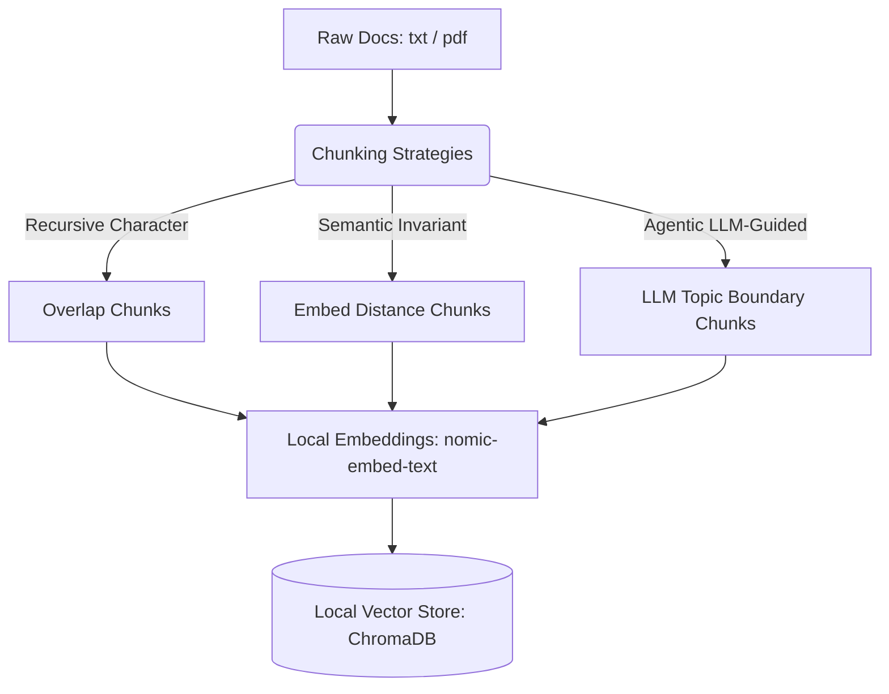
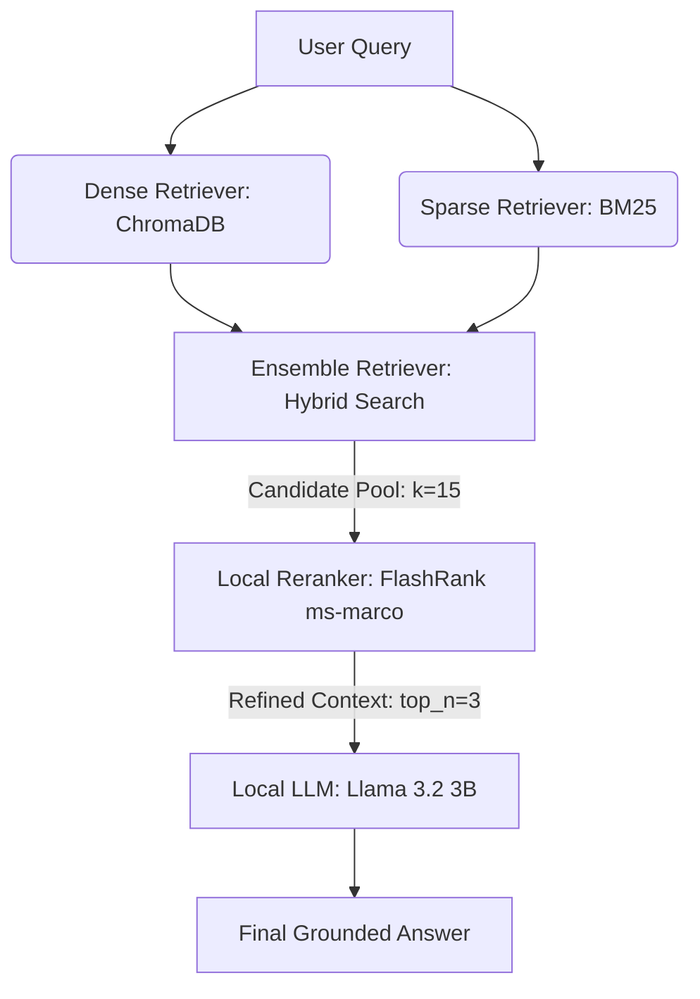

# ⚡ Local AI-Powered RAG System Explorer

[](https://www.python.org/)
[](https://ollama.com/)
[](https://github.com/langchain-ai/langchain)
[](LICENSE)

A comprehensive, modular playground for exploring and benchmarking **100% local, offline Retrieval-Augmented Generation (RAG) pipelines**. This repository documents hands-on experiments with various chunking strategies, multi-stage retrieval pipelines, reranking, and local LLM evaluation metrics using Ollama, ChromaDB, and FlashRank.

---

## 🏗️ System Architecture

### 1. Ingestion Pipeline


### 2. Retrieval & Generation Pipeline


---

## 🌟 Key Features

*   **100% Offline & Private:** Zero external API keys needed (no OpenAI or Cohere charges). Every step runs on local hardware.
*   **Diverse Chunking Strategies:** Compare standard Recursive Character, Semantic distance, and Agentic (LLM-based) splitting.
*   **Multi-Stage Hybrid Search:** Combine keyword matching (BM25) with vector embeddings (Cosine Similarity) using LangChain's `EnsembleRetriever`.
*   **Local Reranking:** Utilize `FlashRank` (`ms-marco-MiniLM-L-6-v2`) via ONNX on CPU to reorder documents by relevance before context windowing.
*   **Sentence-Window Retrieval:** Index single sentences to achieve precise cosine match vectors, but feed the adjacent sentences (sentence window) to the LLM.
*   **HyDE (Hypothetical Document Embeddings):** Prompt a local model to generate a mock answer first, then embed that mock document to query your index.
*   **Local LLM-as-a-Judge Evaluation:** Run offline quality tests to calculate **Faithfulness (Groundedness)** and **Answer Relevance** scores dynamically.
*   **Interactive Web UI Dashboard:** Streamlit-powered workspace to test all pipeline components visually.

---

## 📂 Repository Experiment Map

| Filename | Type | Description |
| :--- | :--- | :--- |
| [1_ingestion_pipeline.py](1_ingestion_pipeline.py) | Script | Standard document ingestion, recursive chunking, and ChromaDB indexing. |
| [2_retrieval_pipeline.py](2_retrieval_pipeline.py) | Script | Similarity and cosine distance searches with score thresholds. |
| [3_answer_generation.py](3_answer_generation.py) | Script | Basic generation linking context and user query with Llama 3.2. |
| [4_history_aware_generation.py](4_history_aware_generation.py) | Script | Conversational RAG with query reformulation based on chat logs. |
| [5_recursive_character_text_splitter.py](5_recursive_character_text_splitter.py) | Script | Character vs. Recursive Character text splitter comparisons. |
| [6_semantic_chunking.py](6_semantic_chunking.py) | Script | Dynamic splitting at semantic percentile shifts using embeddings. |
| [7_agentic_chunking.py](7_agentic_chunking.py) | Script | Splitting documents by prompting an LLM to add topic split markers. |
| [8_multi_modal_rag.ipynb](8_multi_modal_rag.ipynb) | Notebook | Parsing complex PDFs (extracting tables, text, and images) using a local vision model (`moondream`). |
| [9_retrieval_methods.py](9_retrieval_methods.py) | Script | Comparing Vector Search, Thresholding, and Maximum Marginal Relevance (MMR). |
| [10_multi_query_retrieval.py](10_multi_query_retrieval.py) | Script | Query expansion by translating a search query into multiple variations. |
| [11_reciprocal_rank_fusion.py](11_reciprocal_rank_fusion.py) | Script | Implementing Reciprocal Rank Fusion (RRF) to merge query variations. |
| [12_hybrid_search.ipynb](12_hybrid_search.ipynb) | Notebook | Combining Vector Search (Dense) and BM25 Search (Sparse). |
| [13_reranker.ipynb](13_reranker.ipynb) | Notebook | Local multi-stage retrieval + FlashRank compressor + ChatOllama LLM. |
| [14_hyde_retrieval.py](14_hyde_retrieval.py) | Script | Hypothetical Document Embeddings (HyDE) retrieval pipeline. |
| [15_sentence_window_retrieval.py](15_sentence_window_retrieval.py) | Script | Sentence-level indexing with adjacent context window expansion. |
| [16_rag_evaluation.py](16_rag_evaluation.py) | Script | LLM-as-a-Judge scoring for Faithfulness and Relevance offline. |
| [app.py](app.py) | App | Interactive Streamlit Web Dashboard playground. |

### 📊 Streamlit App Feature Comparison
To help navigate the interactive dashboard, here is a quick summary comparing the **Retrieval Playground (Tab 2)** and the **LLM-as-a-Judge Benchmarks (Tab 3)**:

| Feature | Tab 2: Retrieval Playground | Tab 3: LLM-as-a-Judge Benchmarks |
| :--- | :--- | :--- |
| **Pipeline Step** | Retrieval Only | Full Pipeline (Retrieve → Generate → Evaluate) |
| **Outputs** | Raw source chunks | Conversational answer, latency, and quality scores |
| **LLM Generation** | No LLM-generated answer | Yes (Llama 3.2 writes the final response) |
| **Evaluation** | Visual comparison of ranks | Automated Faithfulness & Relevance metrics |

---

## ⚡ Quick Start Guide

### 1. Install Ollama & Pull Models
Download [Ollama](https://ollama.com) and pull the models required for execution:
```bash
# General LLM (Llama 3.2 3B)
ollama pull llama3.2:3b

# General Embeddings (Nomic Text Embeddings)
ollama pull nomic-embed-text

# Vision Model (Required for Multi-Modal notebook 8)
ollama pull moondream
```

### 2. Set Up Virtual Environment & Dependencies
Initialize a virtual environment and install dependencies listed in `requirements.txt`:
```bash
# Clone the repository
git clone https://github.com/your-username/local-rag-explorer.git
cd local-rag-explorer

# Create & activate virtualenv
python -m venv venv
venv\Scripts\activate  # Windows
source venv/bin/activate  # macOS/Linux

# Install requirements
pip install -r requirements.txt
```

### 3. Ingest Sample Documents
Set up your vector index by processing the sample company data located in the `docs` directory:
```bash
python 1_ingestion_pipeline.py
```

### 4. Run the Streamlit Dashboard
Launch the interactive browser application to explore your local pipelines visually:
```bash
streamlit run app.py
```

---

## 📈 Performance & VRAM Optimization Tips
*   **GPU Offloading:** Ensure Ollama utilizes your discrete GPU if available. Ollama handles GPU offloading automatically, but you can check resource consumption with `nvidia-smi` (on NVIDIA hardware).
*   **Model Parameter Sizes:** Llama 3.2 3B is highly optimized for consumer hardware. If your workstation has limited memory (e.g. less than 8GB RAM), consider switching to `gemma2:2b` or `phi3:latest`.
*   **Context Window Limitations:** Ensure `num_ctx` is set appropriately in your `ChatOllama` configurations (default is 2048 tokens). RAG systems with long context windows (e.g., retrieving 10+ chunks) may experience performance slowdowns on CPU.
---

## ?? Benchmarking Guide

This repository is designed to measure both **raw model inference performance** and **end-to-end RAG performance**. The difference matters:

*   **Raw model inference** answers: "How fast does the LLM generate text?"
*   **RAG benchmark** answers: "How fast can the full system retrieve context, generate an answer, and stay grounded in our documents?"

### Core Metrics

*   **Time to First Token (TTFT):** Time from request start until the first generated token is available.
*   **Tokens per Second (TPS):** Generation throughput after the first token.
*   **Total Latency:** End-to-end wall-clock time for a request.
*   **Retrieval Latency:** Time spent fetching context from ChromaDB and optional reranking.
*   **Generation Latency:** Time spent in the LLM call itself.
*   **Quality Scores:** Faithfulness and answer relevance from the local LLM-as-a-judge workflow.

### What The Current App Measures

The Streamlit benchmark in [`app.py`](app.py) currently reports:

*   Retrieved context from the local vector store
*   LLM answer generation
*   Total generation latency for the answer call
*   Faithfulness and relevance scores

It does **not yet** separate TTFT from full completion time, and it does not yet compute tokens/sec.

### Why Use Your Docs In The Benchmark

Including your own documentation makes the benchmark more useful because it measures the system against real production-style inputs. That gives you two different views:

*   **Model-only speed:** Best for isolating Ollama/model performance.
*   **Docs-backed RAG speed:** Best for measuring the user-facing experience of your app.

For the most rigorous comparison, benchmark both:

1. A prompt-only run with no retrieved context
2. A docs-grounded RAG run using `docs/`

That lets you see whether slower performance comes from the model, retrieval, reranking, or context size.

### Recommended Benchmark Output

When you extend the benchmark tab, the most useful metrics to display are:

*   `TTFT`
*   `tokens/sec`
*   `total latency`
*   `retrieval latency`
*   `generation latency`
*   `faithfulness`
*   `relevance`

If you want, this README section can be paired with a small benchmark script or an expanded Tab 3 in the app so the metrics are collected automatically.

### Sample Benchmarks

The Streamlit benchmark tab is easiest to interpret when you reuse a small set of repeatable prompts. A good starter set is:

*   **Tesla revenue model:** `How does Tesla make money?`
*   **Microsoft acquisition:** `How much did Microsoft pay to acquire GitHub?`
*   **Prompt-only baseline:** `Explain retrieval augmented generation in one paragraph.`

These are useful because they cover both:

*   **Docs-grounded RAG cases** where the answer should be supported by your indexed documents
*   **Prompt-only baseline cases** where you can isolate the raw LLM generation speed

That combination makes it easier to spot regressions in retrieval quality, generation latency, or throughput over time.

### Observed Benchmark Example

On the current sample run shown in the app, we observed:

*   `TTFT`: about `8121 ms`
*   `Generation latency`: about `31691 ms`
*   `Retrieval latency`: about `140 ms`
*   `Total latency`: about `31832 ms`
*   `Tokens/sec`: about `7.60`
*   `Output tokens`: about `178`
*   `Faithfulness`: about `80.0%`
*   `Relevance`: about `80.0%`

These numbers are useful as a baseline for the current local hardware, model, and document set. They should be treated as a reference point rather than a universal score, since they will change with model choice, context size, reranking, and machine load.
